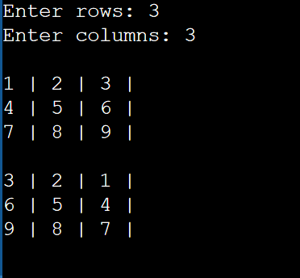

# Lab Assignment 12

In this lab you will practice working with arrays.

Same as the previous labs, you need to set up your workspace (class and main() method).

## Let's get started!

First, let's look at the name of our .java file in the `src/` directory and name your class accordingly and remember to make it `public`. Next, **create your main() method inside your class**.

Now let's begin!

### 2D Arrays

In Java 2D arrays are written a little differently than in C++.

2D Arrays are used to storing data as a tabular form, like a table with rows and columns. 

To declare a 2D array we use to sets of square brackets, `[ ][ ]` **next to its data type** or **next to its identifier**.

**Declaring an array in Java:**
```java
int[][] nums_array;
// or
String word_array[][];
```

Just like 1D arrays, we can allocate memory either during the declaration or afterwards using `new`.

The 1st set of `[ ]` determine the **number of rows**, and the 2nd set of `[ ]` determine the **number of columns**.

**Allocating Memory:**
```java
// During Declaration
String[][] text_array = new String[5][4]; // 5 rows w/ 4 columns

// After Declaration
float[][] nums_array;
nums_array = new float[3][10]; // 3 rows w/ 10 columns
```

You can initialize (assign literal values) to your 2D array either during the declaration using a nested set of `{ }`'s or afterwards by assigning values individually using two sets of `[ ][ ]`.

**Initializing:**
```java
// During Declaration
String[][] car_array = {
    {"Siena", "Camry", "Tundra"},      // 1st row w/ 3 columns
    {"Mustang", "Bronco"},             // 2nd row w/ 2 columns
    {"Tahoe", "Siverado", "Cavalier"}, // 3rd row w/ 3 columns
};

// After Declaration
String[][] color_array = new String[2][2];
// 1st row
color_array[0][0] = "Blue";
color_array[0][1] = "Navy";
// 2nd row
color_array[1][0] = "Red";
color_array[1][1] = "Scarlet";
```

**Accessing Data:**

As shown in the previous section, we can assign or modify specific values in our tabular lik 2D array by specifying the row and column index.

```java
// For the image below, assume you're working with following 2D array.
int[][] x = new int[3][3];
```


For more information on 2D arrays in Java visit: https://www.w3schools.com/java/java_arrays_multi.asp and https://www.geeksforgeeks.org/multidimensional-arrays-in-java/

## Your Assignment

### Array Reversal

Create a 2D array of size *rows* x *columns*, where the value of *rows* and *columns* is provided by the user.

Populate the array with numbers 1 to (*rows* * *columns*). For example, a 3x3 2D array should store values from 1, 2, 3, ..., 9.

Then print out the 2D array.

Next, create a copy of your 2D array.

In the 2D array copy, reverse the values in rows only.

Print out the the 2D array copy.

**Expected Output:**



## Submit your assignment

To submit your lab assignment click on the **Source Control** icon (3 circles with 2 lines) on your leftside navbar. Next, click on the **+** symbol next to **Changes** to stage your changes. Lastly, add a commit message (ex: "First commit") and click **Commit** then **Sync Changes**. And you're done!
